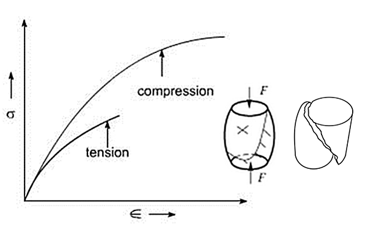
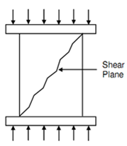

A compression test is a method for determining the behaviour of materials under a compressive load. Compression tests are conducted by loading the test specimen between two plates and then applying a force to the specimen by moving the crossheads together. Here the test specimen is compressed and deformation versus the applied load is recorded. The compression test is used to determine elastic limit, proportional limit,yield point, yield strength, and (for some materials) compressive strength, modulus of elasticity, secant modulus, tangent modulus. Compression tests are of high importance because it helps to calculate the different material properties that are applicable to hot as well as cold metal forging employed for different metal forming applications. Brittle materials in compression will have an initial linear region followed by a region in which the shortening increases at a higher rate than does the load. Thus the compression stress-strain diagram has a shape that is similar to the shape of the tensile diagram.

**Test Specimen**:

In compression testing the material having constant cross sectional area throughout their full length will be used. The gaugelength of a sample in a compression test is its full length. A serious problem in compression testing is the possibility that the sample or load chain may buckle (form bulges or bend) prior to material failure. To prevent this specimens are kept short and stubby. The effect of buckling and friction can be minimized by selecting the length to diameter ratio of the specimen carefully.

Several materials which are good in tension are poor in compression; contrary to this many materials which are poor in tension are very strong in compression. Cast iron is an example of such material. For main brittle materials the elastic properties like elastic limit, modulus of elasticity, yield strength and modulus of resilience are similar in compression and tension.

High strength steel and aluminium alloys do not exhibit a yield point, when a yield point is not easily defined based on the shape of the stress-strain curve, then an offset yield point (proof stress) is arbitrarily defined. The value for this is commonly set at 0.2% plastic strain.Materials like cast iron are weak in tension because of the presence of sub-microscopic cracks and faults. In compression test the cross sectional area of the specimen increases which tends to increase the compressive strength. Therefore reach much higher ultimate stresses in compression than in tension. Also the brittle materials actually fracture or break at the maximum load by splitting or by cracking.

The brittle test piece fractures in compression because of shearing along a plane inclined to the axis. The orientation of the plane of shear is affected by the compressive stresses, the shear of plane may vary from 35o and 45o along with the axis. In brittle materials some lateral bulging will tend to happen during loading, such lateral deformation is greatly controlled at flat specimen ends because of friction between the specimen ends and the platens. This friction decreases as the length of the specimen increases.

**RELEVANT INDIAN STANDARD FOR COMPRESSION TEST**:

1. IS 13780 (1993): Hardmetals - Compression Test.
